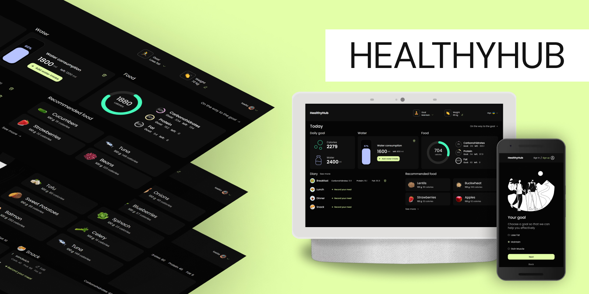

# HealthyHub (App)

**Team project.**  
**Title:** HealthyHub  
**Target:** app development according to the design layout using the Vite
bundler.  
**Description:** HealthyHub is a app-tracker for those who monitor their diet.

Depending on your weight, height, age, and goals, the app provides personalized
recommendations for calorie and water consumption. It also shows in the form of
pie charts how much of the recommendations for daily calorie, carbohydrate,
protein, and fat intake have been met.

The app allows you to:

👉 keep a food diary (add, correct and delete foods that were consumed during
the day);  
👉 keep track of the amount of calories and water consumed by month, as well as
track your weight;  
👉 view a list of suggested foods with information on the calorie content per
100 grams of food;  
👉 change information and add an avatar in the user profile;  
👉 change the login password;  
👉 delete a user from the application.

**Skills:** HTML/CSS, JavaScript, React/Router DOM, Redux/toolkit/persist,
Axios, Chart.js, Formik/Yup, Styled-components, Figma, Git/GitHub, Vite, Postman
, Teamwork.

**Basic functionality:**

- Designed according to the mobile-first approach.
- Implemented layout with three fractures (for mobile devices, tablets, and
  desktop).
- The layout is valid.
- Compliance with semantics in accordance with HTML5 standards.
- Connecting fonts using font-face.
- Optimization of vector and raster graphics sizes.
- Optimization of image loading.
- Added display of the page favicon for browsers and app icons for mobile
  devices.
- Providing support for displaying images for retina screens.
- Implementation of the frontend-y project on Vite + React (Build - github.com).
- Implementation of the backend-y project on Node.js (Build - render.com).

# HealthyHub (App)

**Командний проект.**  
**Назва:** HealthyHub  
**Ціль:** розробка додатку згідно дизайн-макету з використанням збірника Vite.  
**Опис:** Трекер-додаток «HealthyHub» для тих, хто слідкує за своїм харчуванням.

Залежно від ваги, зросту, віку та поставлених цілей додаток надає
персоналізовані рекомендації по споживанню калорій та води. А також показує у
вигляді кругових діаграм на скільки рекомендації по щоденному споживанню
калорій, вуглеводів, білків і жирів були досягнуті.

В додатку є можливість:  
👉 вести щоденник харчування (додавати, корегувати та видаляти продукти які були
спожитті протягом дня);  
👉 відслідковувати за місяцями спожиту кількість калорій та води, а також
відстежувати свою вагу;  
👉 переглянути перелік запропонованих продуктів харчування з інформацією про
вміст калорій на 100г продукту;  
👉 змінювати інформацію та додавати аватарку в профілі користувача;  
👉 змінювати пароль для входу;  
👉 видалення користувача з додатку.

**Навички:** HTML/CSS, JavaScript, React/Router DOM, Redux/toolkit/persist,
Axios, Chart.js, Formik/Yup, Styled-components, Figma, Git/GitHub, Vite, Postman
, Teamwork.

**Базовий функціонал:**

• Розроблено по макету відповідно до підходу mobile-first.  
• Реалізована верстка з трьома переломами (для мобільних девайсів, планшетів та
десктопу).  
• Верстка валідна.  
• Дотримання семантики відповідно до стандартів HTML5.  
• Підключення шрифтів за допомогою font-face.  
• Оптимізація розмірів векторної та растрової графіки.  
• Оптимізація завантаження зображень.  
• Додано відображення фавікону сторінки для браузерів та іконок додатку для
мобільних пристроїв.  
• Забезпечення підтримки відображення картинок для retina-екранів.  
• Реалізація frontend-y проекту на Vite + React (Build - github.com).  
• Реалізація backend-y проекту Node.js (Build - render.com).
